# cpp-exchange

https://minip8.github.io/#project/cpp-exchange

A limit-order-book matching engine in C++26, plus a networked front end around
it.

## Docs

- **[docs/BUILDING.md](docs/BUILDING.md)** — prerequisites, the three build
  trees (`debug` / `tsan` / `release`), every preset, and where binaries land.
- **[docs/RUNNING.md](docs/RUNNING.md)** — the server, the CLI, the browser GUI,
  and the four checks that stand in for a unit-test suite.
- **[docs/BENCHMARKING.md](docs/BENCHMARKING.md)** — Google Benchmark, the
  flash1 conformance harness, the network benches, and how to read the numbers.

```bash
cmake --preset debug && cmake --build --preset debug     # develop here
cmake --preset release && cmake --build --preset release # benchmark here
```

`CLAUDE.md` has the architecture and design rationale.

## Benchmarks (OrderBook)

Features/changes at each stage of the project, with what each one measured.

All six commits below were **re-measured in one sitting** with today's benchmark
sources (`scripts/bench_backfill.sh`), so the numbers are comparable with each
other — records made by two different versions of a benchmark are not. Every run
is 5 flash1 `perf` reps per scenario, all `VALID`; the score is the **worst-case
scenario, not the average**. Google Benchmark runs at one repetition, so treat
small step-to-step deltas as noise.

Each commit gets three plots: flash1 throughput per scenario, the Google
Benchmark microbenchmarks, and the **per-operation latency distribution** — the
only one that shows shape rather than an average, which is what makes a
structural cost visible as the whole curve moving rather than as a fatter tail.
The `per-op ns` figures quoted below come from the *uninstrumented* `_NoTiming`
twin, not the timed row beside it: the fences the timed version needs cost
10-90% and also forbid cross-operation overlap, so the instrumented number is
the instrument's, not the engine's. It is also engine-only, where the flash1
M msgs/s goes through the harness.

Full detail, and how to read the plots, in
**[docs/BENCHMARKING.md](docs/BENCHMARKING.md)**.

### 612785f

The simplest approach - store all `Order`s in a `std::vector`, with the exception of mapping `OrderId`s to their respective `Buy` and `Sell` sides.

flash1 M msgs/s — static 1.09 · normal 1.91 · swing-25 0.16 · swing-40 0.09 · **flash-crash 0.06** (worst case)

per-op ns (uninstrumented) — static 963 · normal 472 · swing-25 6321 · swing-40 10512 · **flash-crash 16963**

This row is the baseline quoted throughout `CLAUDE.md`, and the collapse on the
volatile scenarios is the thing every later commit is answering. `removeOrder`
here empties a `PriceLevel` but never erases it, so dead levels accumulate and
every subsequent scan walks them — which is also why this commit's two
`AtDepth` microbenchmarks look deceptively quick (they re-use a resident level
and never pay for an insert). Don't compare those two against the rows below.

The distribution is the direct evidence for that. On flash-crash the **median**
`new` is 22.9 us — not the tail, the middle — while `cancel`, which finds its
order through the id map instead of scanning, sits at 5.6 us. The whole curve
moves, which is what an O(n) scan over accumulating corpses looks like and what
an occasional deep sweep does not. Per-op cost tracks how much level churn a
scenario creates, from 963 ns on `static` to 17 us on `flash-crash`.

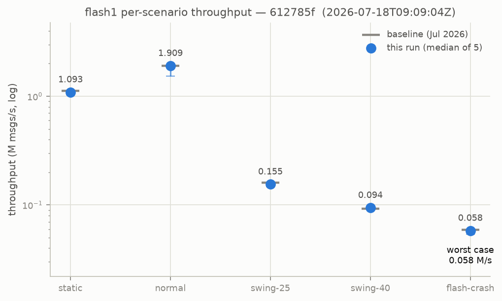

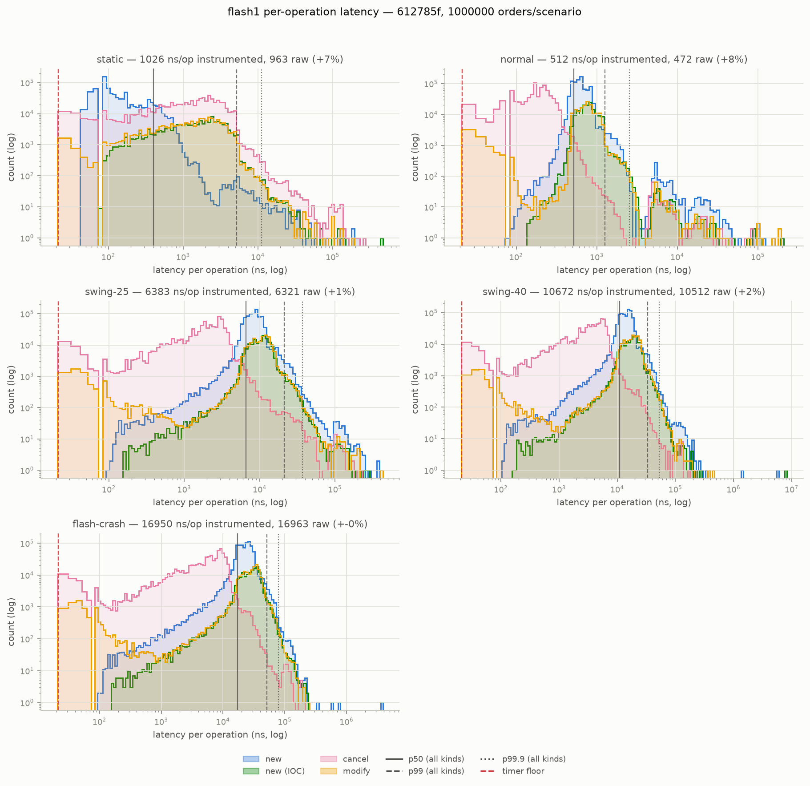

### 28895d3

Store `PriceLevel`s in sorted order in a `std::vector`.

Each `PriceLevel` stores a `std::vector<Order>`, sorted by time.

Delete `PriceLevel`s that are empty.

flash1 M msgs/s — **static 1.02** · normal 3.26 · swing-25 1.30 · swing-40 1.67 · flash-crash 3.55 (worst case)

per-op ns (uninstrumented) — **static 838** · normal 246 · swing-25 716 · swing-40 509 · flash-crash 208

The big one: flash-crash goes 0.06 → 3.55 M/s, ~60×, and swing-25 0.16 → 1.30.
Erasing empty levels is what does it — the scan stops walking corpses, and per-op
cost on flash-crash falls **16,963 → 208 ns**, 81×. The worst case moves off
flash-crash onto `static` and stays there for the rest of the project. The price
shows up in the microbenchmarks: with levels sorted best-first and empty ones now
erased, a best-price insert lands at `begin()` and shifts the whole vector, so
`best-price insert @1024` is **3,238 ns** against `worst-price @1024` **1,227 ns**.

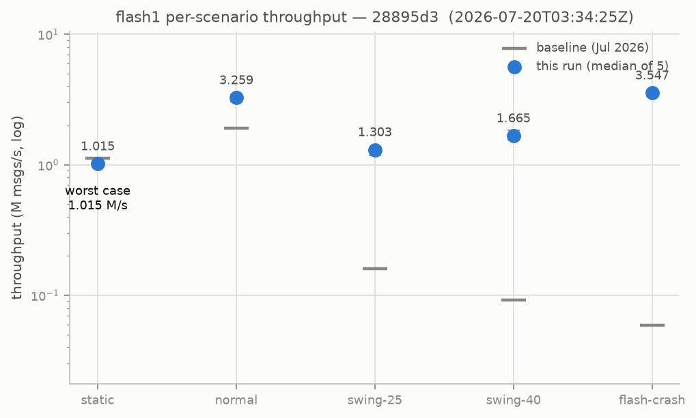
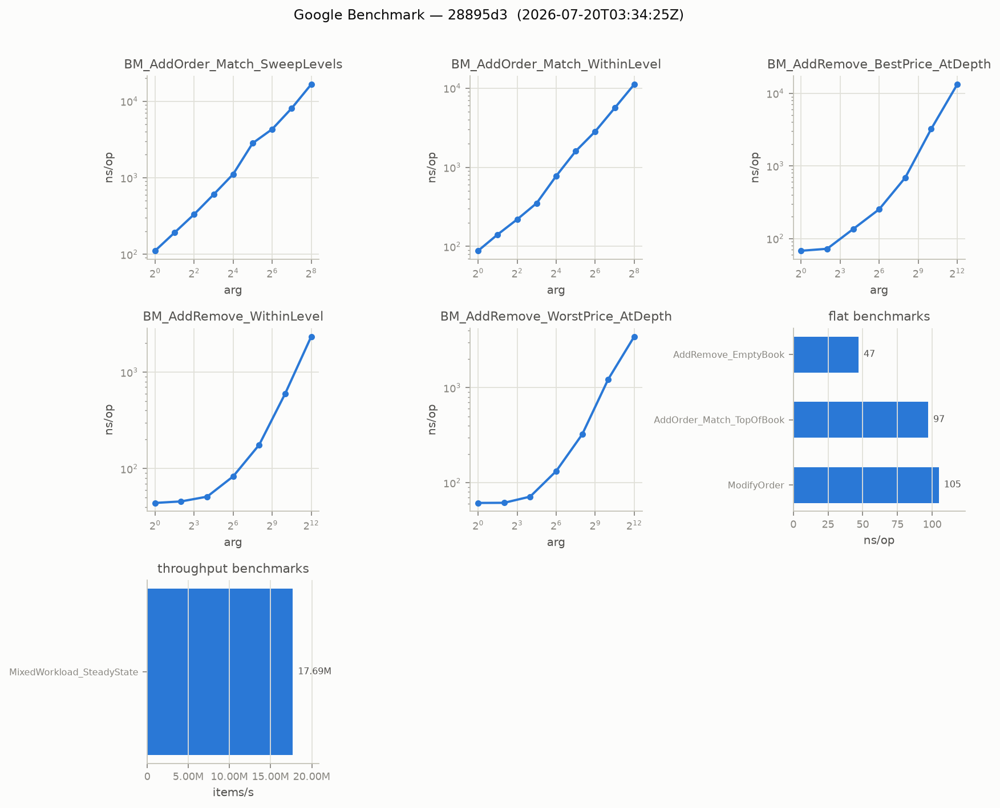
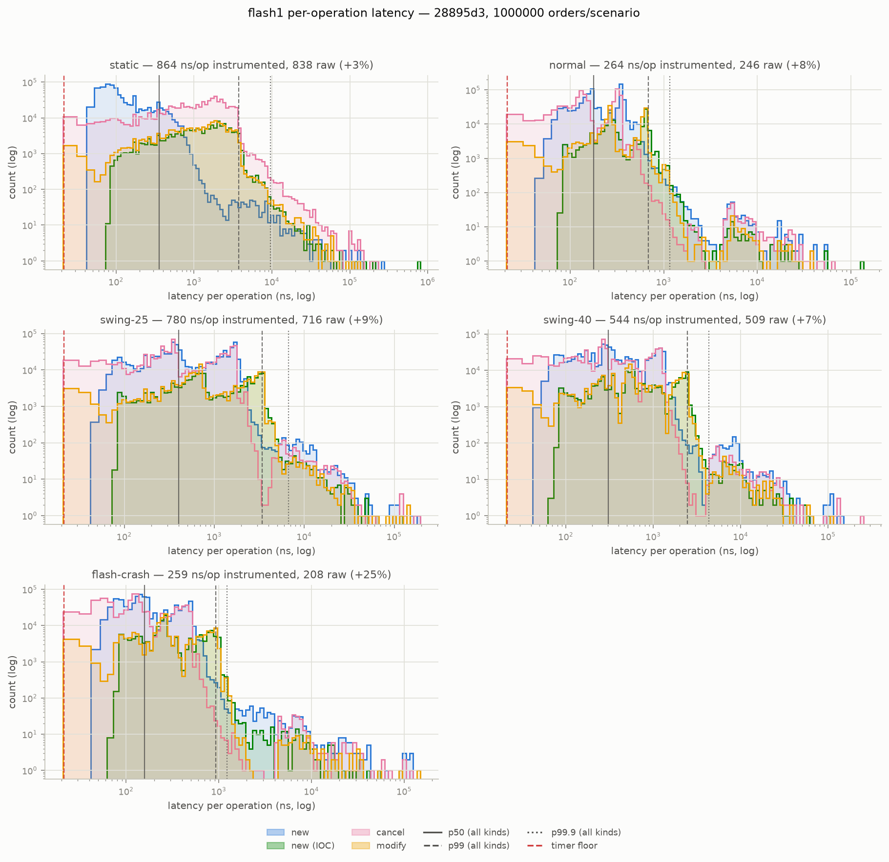

### 83bd5ae

Replace `std::function_ref match_predicate` with inlined lambdas by templating `match` on `OrderSide`.

flash1 M msgs/s — **static 1.11** · normal 3.10 · swing-25 1.36 · swing-40 1.66 · flash-crash 3.64 (worst case)

per-op ns (uninstrumented) — **static 967** · normal 241 · swing-25 717 · swing-40 515 · flash-crash 210

A codegen change, and it reads like one — worst case 1.02 → 1.11, best-price
insert 3,238 → 2,860 ns, per-op essentially unmoved. Real but small, and at one
repetition not much above the noise floor.

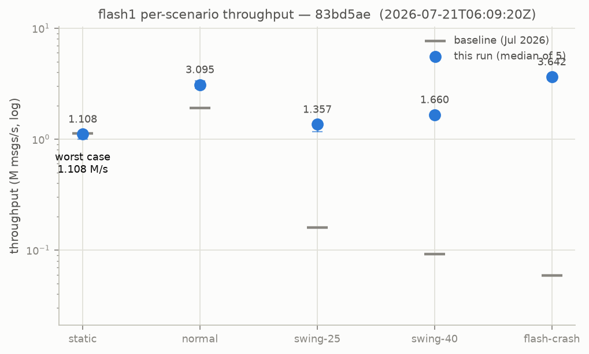

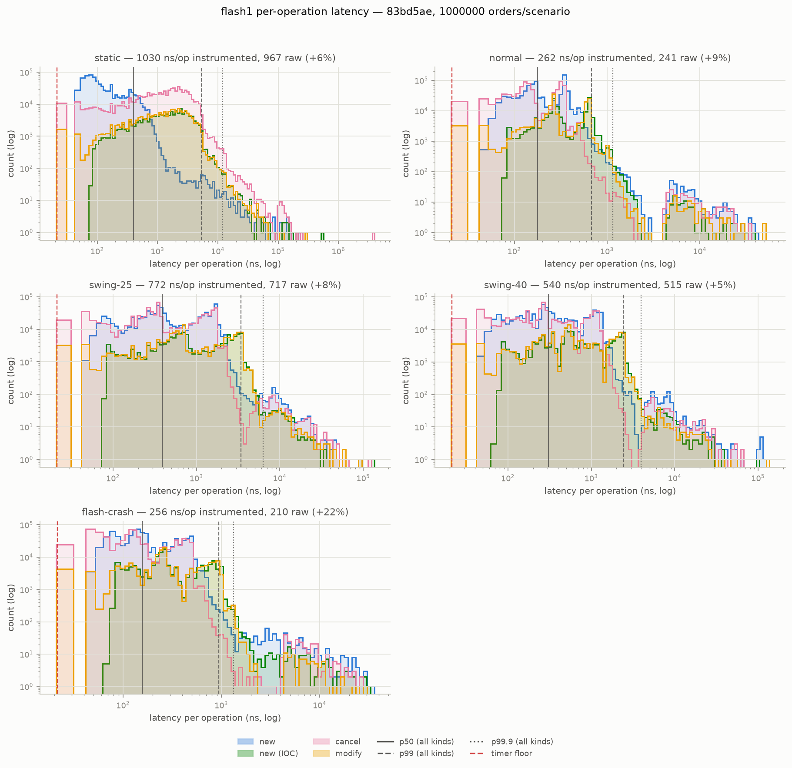

### f8c5fb6

Give each `OrderBook` a `Symbol`, and pick the resting side with `if constexpr` rather than a runtime branch.

flash1 M msgs/s — **static 1.12** · normal 3.47 · swing-25 1.25 · swing-40 1.80 · flash-crash 3.74 (worst case)

per-op ns (uninstrumented) — **static 933** · normal 238 · swing-25 704 · swing-40 506 · flash-crash 207

Flat, as intended — `Symbol` is addressing, not matching, and it is deliberately
kept off the hot path. Every per-op figure is within a few ns of `83bd5ae`, which
is the measurement saying exactly that. This is the first commit with a
`MatchingEngine` routing benchmark (`BM_Engine_MultiBook_SteadyState/100`,
14.6 M items/s); the three commits above predate it.

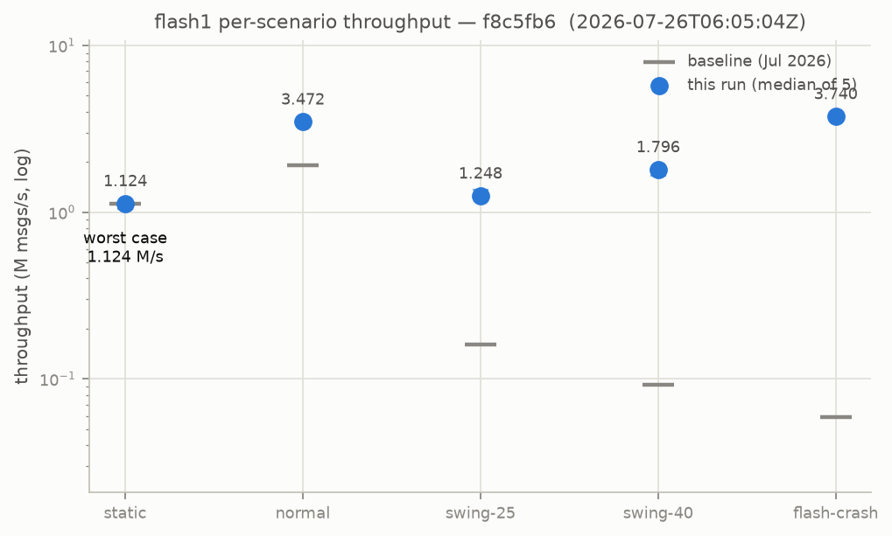
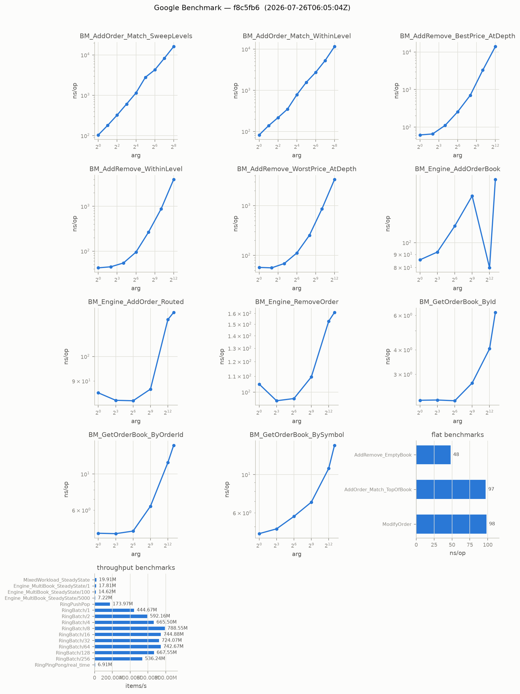
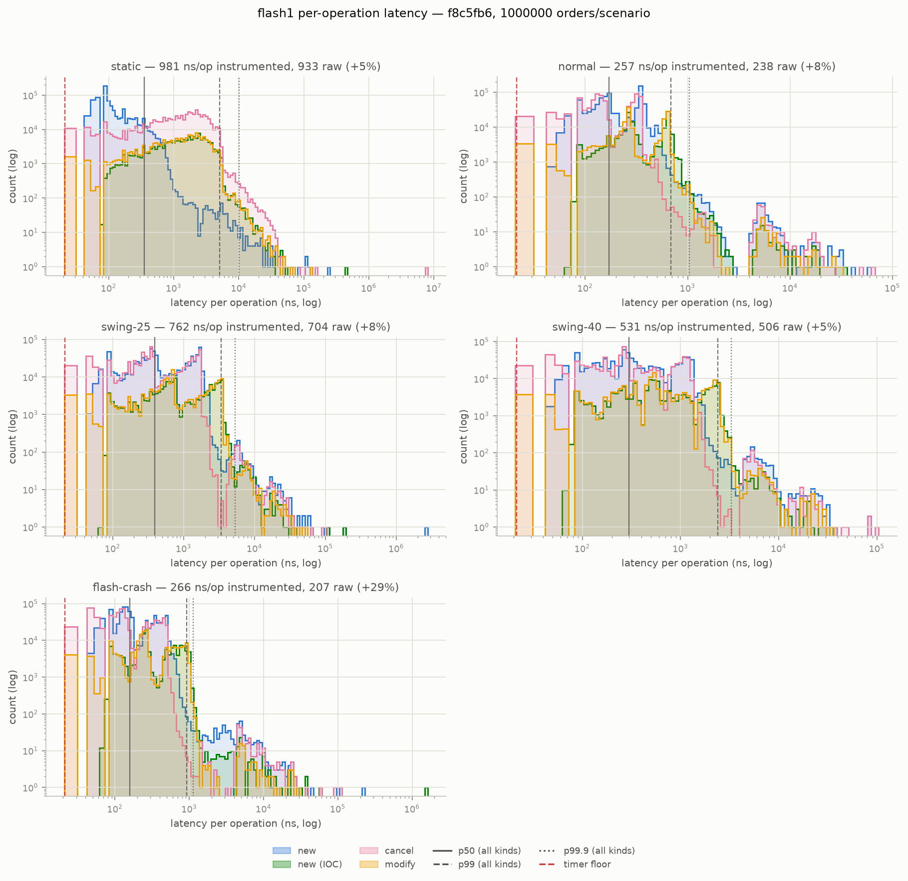

### 586ecc6

Store `PriceLevel`s in the reverse order, so the best prices are at the back of the `std::vector`.

flash1 M msgs/s — **static 1.21** · normal 9.70 · swing-25 8.62 · swing-40 9.98 · flash-crash 11.53 (worst case)

per-op ns (uninstrumented) — **static 622** · normal 53 · swing-25 68 · swing-40 54 · flash-crash 44

The second big one, and the clearest trade in the project. Matching consumes
from the best end, so putting it at `back()` makes a new best price a
`push_back` and a sweep a suffix erase: **best-price insert @1024 collapses
3,300 → 54 ns**, ~61×, paid for at the other end with worst-price 859 → 4,013 ns.
That is the intended bargain — activity concentrates at the top of book. Every
volatile scenario roughly triples (swing-25 1.25 → 8.62), and per-op cost drops
~5× across all four of them (flash-crash 207 → 44 ns). `static` moves least
(933 → 622) and is left as the clear bottleneck.

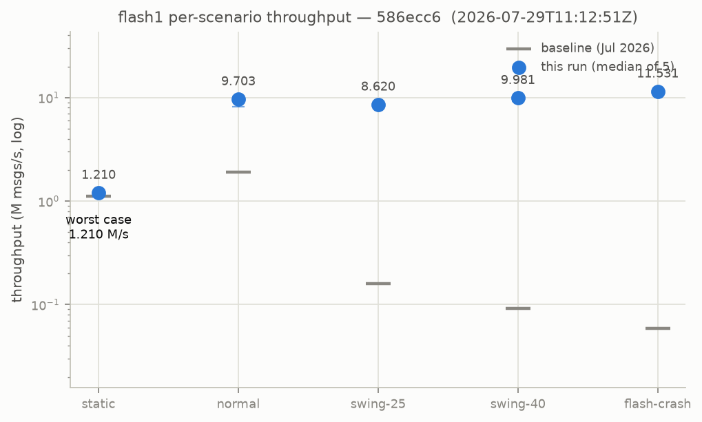
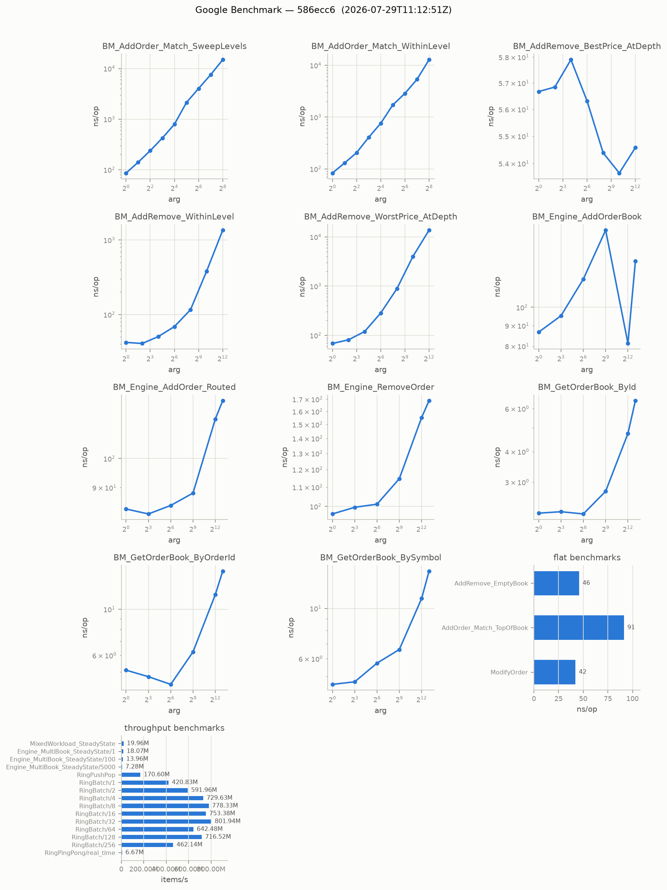
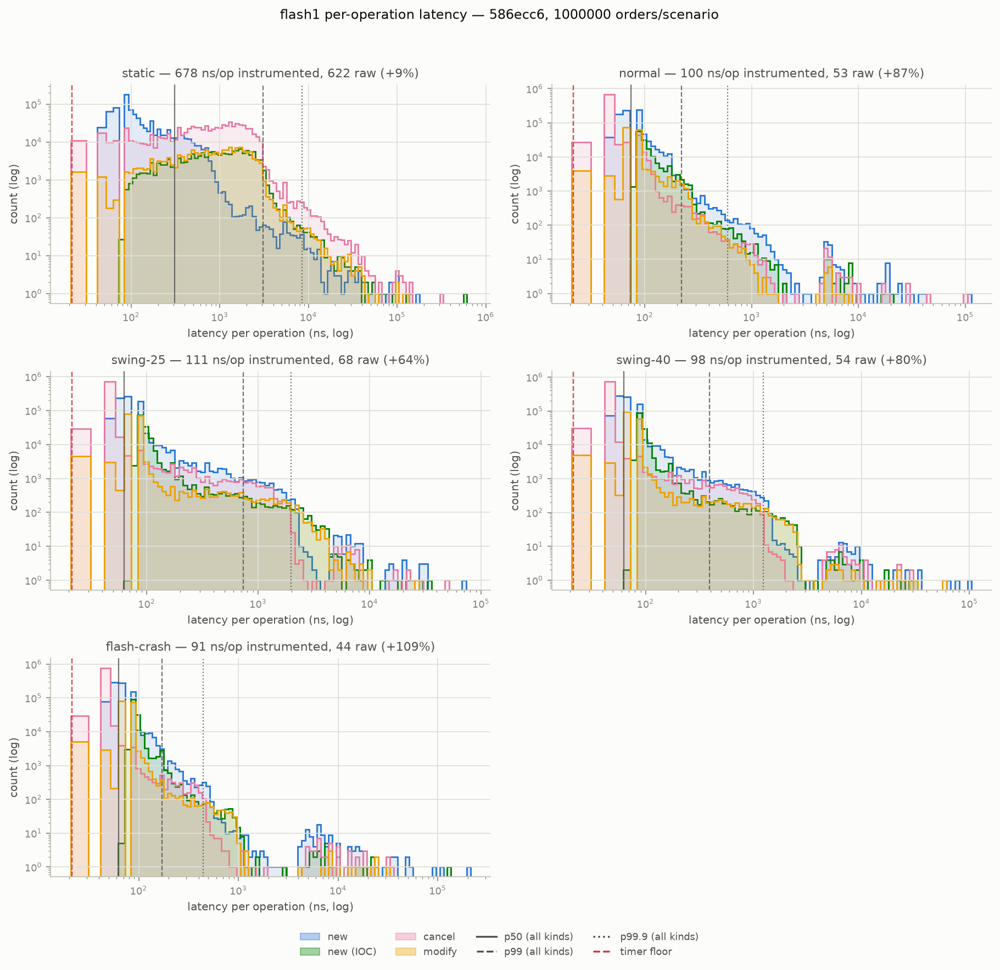

### cb5c9ca

Store the `Order`s inside the `PriceLevel::orders` in reverse order, so highest time priority is at the back.

flash1 M msgs/s — **static 0.58** · normal 9.79 · swing-25 7.94 · swing-40 9.72 · flash-crash 10.88 (worst case)

per-op ns (uninstrumented) — **static 1524** · normal 54 · swing-25 65 · swing-40 52 · flash-crash 44

The same idea applied one level down, and it does not pay. `push_back` becomes
`insert(begin())`, so every resting order shifts the whole level: `static` per-op
goes **622 → 1,524 ns** while the other four scenarios do not move at all, and
`AddRemove_WithinLevel/256` doubles (116 → 244 ns). `static` is the scenario that
rests the deepest levels, so it is the one that pays — and it was already the
worst case, so the score halves, 1.21 → 0.58. Reverted in `fbd2446`.

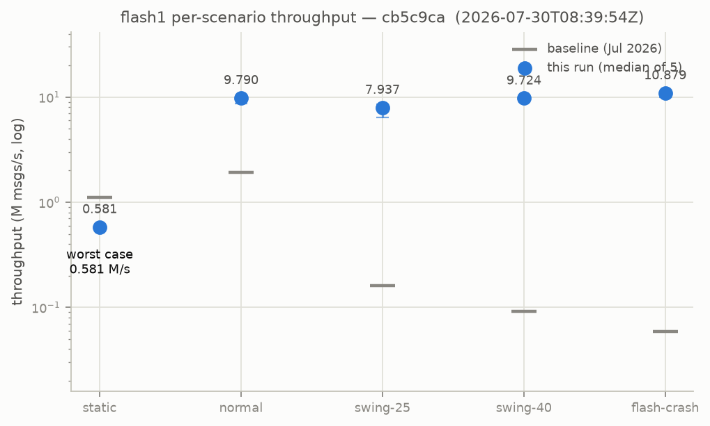

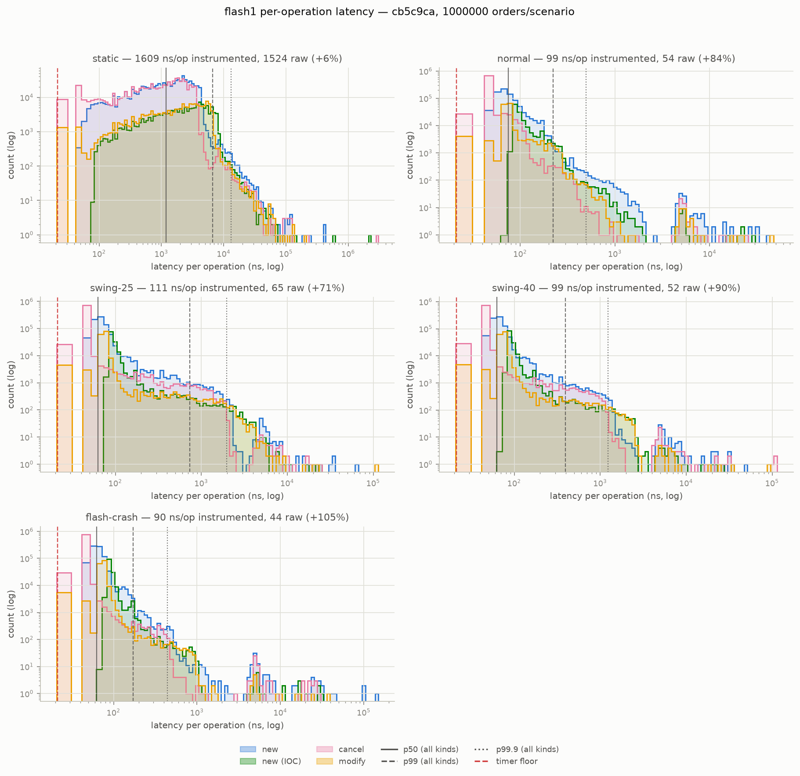

## Networking (feat. Claude)

The engine is a pure in-process library; `exchange_server` is the networked
front end around it. Two protocols over one core: a custom binary TCP
protocol for algo clients, and WebSocket/JSON for the browser GUI. I/O
threads feed a dedicated matching thread through lock-free SPSC rings.

```bash
cmake --build --preset debug
cp config/traders.example.json config/traders.json   # then edit the keys
./build/debug/src/net/exchange_server
```

- **binary TCP, port 9001, loopback only.** Never exposed publicly. Use
  `exchange_cli --key <key>` — `help` lists the commands.
- **HTTP + WebSocket, port 8080.** Serves `web/` and the GUI's `/ws`
  endpoint. This is the only port that faces the internet.

### Exposing it

Only 8080 is meant to be reachable. Cloudflare Tunnel needs no inbound
firewall rule and terminates TLS for you:

```bash
cloudflared tunnel --url http://localhost:8080
```

The binary port stays bound to 127.0.0.1 regardless (`--binary-bind` can
change that, but there is no reason to). Give each trader their own key in
`config/traders.json`; the file is gitignored and only the example is
checked in.

### Checks

```bash
./build/debug/src/net/net_smoke   # rings, gateway, codecs, fuzz, loopback
./build/tsan/src/net/net_smoke    # the same, under ThreadSanitizer
scripts/net_e2e.sh                # binary protocol + market-data replay gate
scripts/ws_e2e.py                 # two browser clients trade; ladders agree
```

`net_smoke` must pass under both the `debug` (ASan/UBSan) and `tsan` trees.
That pair is the substitute for a unit-test suite. See `CLAUDE.md` for the
architecture and `.claude/plans/` for the design rationale.
